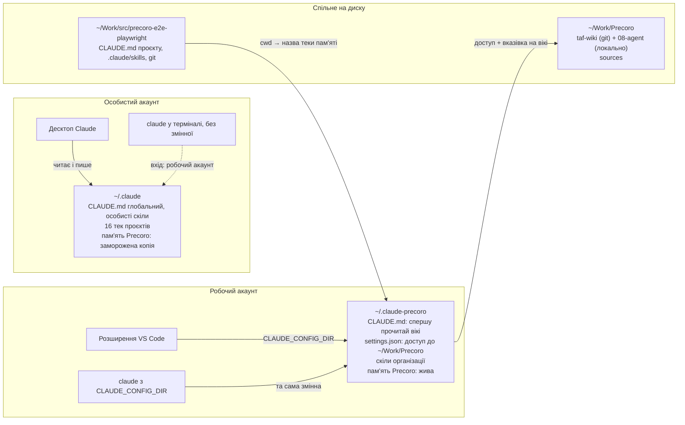
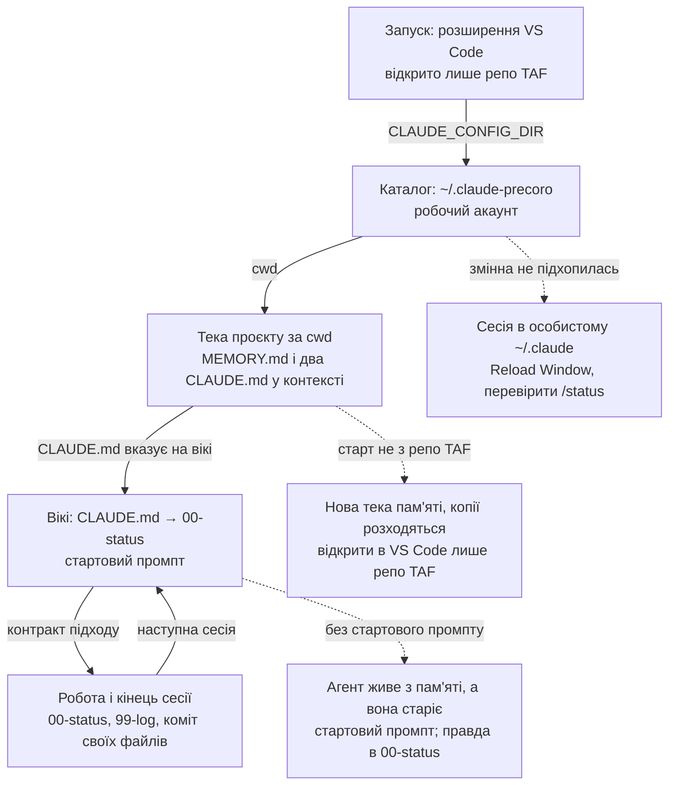

# Маршрути пам'яті Claude

Як розведені конфігурація і пам'ять Claude між особистим і робочим акаунтом для роботи над TAF. Стан на 2026-09-24, перевірено командами на диску і `/status` + `/memory` у розширенні. Як запускати коротко: `CLAUDE.md`, розділ "Запуск"; цей файл пояснює, як воно влаштоване і де ламається.

Та сама карта як сторінка зі схемами (особистий акаунт, приватна): https://claude.ai/artifact/Rboe9Yhcu1u785gsLAMV58

## Головне

Особисте і робоче розведені за **каталогом конфігурації**. Каталог обирає точка входу: змінна `CLAUDE_CONFIG_DIR` або її відсутність (тоді `~/.claude`). Усередині каталогу **теку пам'яті обирає тека, з якої стартувала сесія**: `projects/` + повний шлях, де `/` замінено на `-`. Сесія читає лише теку, що відповідає її старту; решта не завантажується. Правда про стан роботи живе не в пам'яті, а у вікі (`00-status.md`).

## Хто куди пише

## Робоча сесія від старту до кінця

Цикл замикається через вікі, а не через пам'ять. Усі три гілки збою вже траплялись: розширення без перезавантаження працювало з `~/.claude`; старт із теки вікі свого часу дав другу, застарілу копію пам'яті (прибрана 24.09).

## Де що живе

| Що | Де | Хто пише | Хто читає |
| --- | --- | --- | --- |
| Маршрут розширення | налаштування користувача VS Code, `claudeCode.environmentVariables` → `CLAUDE_CONFIG_DIR=/Users/yevhenlyashenko/.claude-precoro` | вручну | розширення при старті, після Reload Window |
| Вхід робочим акаунтом | `~/.claude-precoro/.claude.json` і Keychain | `/login` | розширення, `claude` зі змінною |
| Вказівка читати вікі | `~/.claude-precoro/CLAUDE.md` | вручну | кожна робоча сесія, автоматично |
| Доступ до вікі і матеріалів | `~/.claude-precoro/settings.json`, `permissions.additionalDirectories` | вручну | кожна робоча сесія |
| Модель за замовчуванням | `~/.claude-precoro/settings.json`, `model: claude-opus-5-5`; перебиває `ANTHROPIC_MODEL` з VS Code | вручну | кожна нова робоча сесія |
| Жива пам'ять Precoro | `~/.claude-precoro/projects/-Users-yevhenlyashenko-Work-src-precoro-e2e-playwright/memory` | агент, автоматично | робоча сесія з теки репо TAF |
| Заморожена копія пам'яті | `~/.claude/projects/-Users-yevhenlyashenko-Work-src-precoro-e2e-playwright/memory` | ніхто після 24.09 | особиста сесія, якщо стартує в репо TAF |
| Інструкції проєкту | `CLAUDE.md` і `.claude/skills` у репо TAF, git | команда AQA | будь-яка сесія в репо |
| Стан роботи | `00-status.md`, `99-log.md` у вікі, git | агент наприкінці сесії | агент на старті |
| Контекст агента і особисте | `08-agent/` у вікі, лише локально, у `.gitignore` | вручну | агент за порядком читання |
| Первинні джерела | `~/Work/Precoro/sources` | вручну | за потреби |
| Транскрипти розмов | `projects/<тека>/*.jsonl` у відповідному каталозі | Claude, автоматично | `--resume` |

## Що закрито і що ні

- [x] Розширення VS Code працює з `~/.claude-precoro`. Перевірено з обох боків: на диску сесія з `entrypoint: claude-vscode`; у розширенні `/status` показує робочий акаунт і теку репо TAF, `/memory` веде в каталог з однією текою проєкту.
- [x] Жива пам'ять Precoro в одному місці; дубль для теки вікі перенесено в кошик (копії були ідентичні).
- [x] Робочі сесії бачать `~/Work/Precoro` через `additionalDirectories`, без `--add-dir`.
- [x] Модель робочих сесій: `"model": "claude-opus-5-5"` у `~/.claude-precoro/settings.json` (24.09). Рядок у `settings.json` перебиває змінну `ANTHROPIC_MODEL=claude-opus-4-8`, яка лишилась у налаштуваннях VS Code; без нього робочі сесії йшли на Opus 4.8.
- [ ] `claude` у терміналі без змінної працює з особистим `~/.claude`, але залогінений робочим акаунтом (`~/.claude.json`). Для особистого використання потрібен `/login` особистим акаунтом.
- [ ] Чи не зачепив робочий вхід десктопний застосунок, окремо не перевірено; у нього власний вхід.
- [ ] Змінна діє на всі вікна VS Code: розширення дозволяє задати її лише на рівні машини, не для теки.
- [ ] Заморожена копія пам'яті в `~/.claude` не видалена; рішення, коли робоча схема постоїть.
- [ ] `08-agent/` існує лише на цьому Mac.

## Що досі робиться руками

1. Після зміни налаштувань VS Code: `Cmd+Shift+P` → Developer: Reload Window.
2. `/login` у новому каталозі, стежачи, який акаунт відкритий у браузері.
3. Стартовий промпт на початку робочої сесії (`CLAUDE.md`).
4. Перенесення `08-agent/` і `sources` на іншу машину.
5. Видалення замороженої копії пам'яті.

## Перевірка

- `/status`: робоча пошта, Working folder = репо TAF, Model = `claude-opus-5-5`.
- `/memory` → Open auto-memory folder: шлях починається з `~/.claude-precoro/projects/`, ліворуч одна тека проєкту.

## Відкат

Прибрати елемент `CLAUDE_CONFIG_DIR` з `claudeCode.environmentVariables` або повернути `settings.json.bak-2026-09-24` поруч із налаштуваннями VS Code; Reload Window.
